# Ζητούμενο 5 - Query 4: Κοντινότερο Αστυνομικό Τμήμα & Κλιμακωσιμότητα

## 5.1 Περιγραφή Query 4

Για κάθε αστυνομικό τμήμα (division) του LAPD υπολογίζεται:
1. **Αριθμός εγκλημάτων** που έλαβαν χώρα πλησιέστερα σε αυτό απ' οποιοδήποτε άλλο τμήμα
2. **Μέση απόσταση** (km) μεταξύ του τμήματος και των τοποθεσιών αυτών των εγκλημάτων

Αποτελέσματα ταξινομημένα κατά φθίνοντα αριθμό περιστατικών.

### Αλγόριθμος

```
1. Φόρτωση crime data → φίλτρο έγκυρων συντεταγμένων (LAT≠0, LON≠0)
2. Φόρτωση 21 αστυνομικών τμημάτων (πολύ μικρό dataset → broadcast)
3. Cross Join: κάθε έγκλημα × 21 τμήματα = 21 αποστάσεις ανά έγκλημα
4. Ανά έγκλημα: εύρεση τμήματος με ελάχιστη απόσταση (F.min struct trick)
5. GROUP BY division → COUNT(*), AVG(distance)
6. ORDER BY crime_count DESC
```

### Τύπος απόστασης

Ευκλείδεια προσέγγιση σε km (έγκυρη για τη μικρή γεωγραφική έκταση του LA):

```
d = sqrt( (Δlat × 111.0)² + (Δlon × 92.0)² )  [km]
```

Στο γεωγραφικό πλάτος 34°Β (Los Angeles):
- 1° γεωγραφικού πλάτους ≈ 111.0 km
- 1° γεωγραφικού μήκους ≈ 111.0 × cos(34°) ≈ 92.0 km

---

## 5.2 Join Strategies: Ανάλυση Catalyst Optimizer

### Εμφάνιση του physical plan

```bash
spark-submit ... Q4_df.py --base-path ... --explain
```

Ή από Python REPL:
```python
result_df.explain("formatted")
```

### Σχολιασμός

Εκτελώντας την υλοποίηση Dataframe, μπορούμε μέσω της .explain() να απεικονίσουμε το Εκτελέσιμο Σχέδιο, που έχει βελτιστοποιηθεί από τον Catalyst. (βλ. πλήρες σχήμα στο github repository), εδώ θα αποτυπώσουμε μόνο το πρώτο μέρος του που αφορά το Join

```mermaid
flowchart LR
    classDef scan     fill:#d4edda,stroke:#28a745,color:#000
    classDef join     fill:#fff3cd,stroke:#ffc107,color:#000
    classDef project  fill:#e2e3e5,stroke:#6c757d,color:#000
    classDef sortnode fill:#cce5ff,stroke:#004085,color:#000
    classDef aggSort  fill:#f8d7da,stroke:#721c24,color:#000
    classDef aggHash  fill:#d1ecf1,stroke:#0c5460,color:#000
    classDef exchange fill:#e8d5f5,stroke:#6f42c1,color:#000
    classDef result   fill:#c3e6cb,stroke:#155724,color:#000

    CRIMES["Scan CSV<br/>LA_Crime_Data_*.csv<br/>select: DR_NO, LAT, LON<br/>filter: LAT≠0 AND LON≠0"]:::scan

    STATIONS["Scan CSV<br/>LA_Police_Stations.csv<br/>select: DIVISION, Y, X"]:::scan

    BCAST["BroadcastExchange<br/>21 rows · ~2 KB"]:::exchange

    N7["BroadcastNestedLoopJoin<br/>Cross Join · condition: None<br/>crimes × 21 stations"]:::join

    N8["Project<br/>distance_km = √ ( (Δlat·111)² + (Δlon·92)² )"]:::project

    N9["Sort<br/>DR_NO ASC"]:::sortnode

    N10["SortAggregate — partial<br/>keys: DR_NO<br/>partial_min( struct(distance_km, division) )"]:::aggSort

    N11["Exchange<br/>hashpartitioning(DR_NO, 200)<br/>shuffle — find nearest station"]:::exchange

    N12["Sort<br/>DR_NO ASC"]:::sortnode

    N13["SortAggregate — final<br/>keys: DR_NO<br/>min(struct) → nearest"]:::aggSort

    N14["Project<br/>nearest.division<br/>nearest.distance_km"]:::project

    N15["HashAggregate — partial<br/>keys: division<br/>partial_avg(distance_km), partial_count(1)"]:::aggHash

    N16["Exchange<br/>hashpartitioning(division, 200)<br/>shuffle — aggregate per division"]:::exchange

    N17["HashAggregate — final<br/>keys: division<br/>avg(distance_km) → average_distance<br/>count(*) → crime_count"]:::aggHash

    N18["Exchange<br/>rangepartitioning(crime_count DESC, 200)<br/>shuffle — global sort"]:::exchange

    N19["Sort<br/>crime_count DESC NULLS LAST"]:::sortnode

    OUT["Result<br/>division | average_distance | crime_count"]:::result

    STATIONS --> BCAST
    CRIMES  --> N7
    BCAST   --> N7
    N7  --> N8
    N8  --> N9
    N9  --> N10
    N10 --> N11
    N11 --> N12
    N12 --> N13
    N13 --> N14
    N14 --> N15
    N15 --> N16
    N16 --> N17
    N17 --> N18
    N18 --> N19
    N19 --> OUT
```



Με βάση λοιπόν το physical plan που εκτυπώθηκε κατά την εκτέλεση, ο Catalyst Optimizer επέλεξε BroadcastNestedLoopJoin για το cross join μεταξύ του crime dataset και του πίνακα των αστυνομικών τμημάτων, με Join condition: None, επιβεβαιώνοντας ότι πρόκειται για καθαρό cross join χωρίς equi-join συνθήκη. 

Πιστεύω πως είναι λογική η επιλογή για το συγκεκριμένο πρόβλημα: το BroadcastHashJoin που χρησιμοποιείται στις κλασικές joins απαιτεί equi-join condition (π.χ. a.key = b.key) ώστε να κτίσει hash table και να κάνει lookup, όμως εδώ δεν υπάρχει τέτοια συνθήκη, αφού κάθε έγκλημα πρέπει να συνδυαστεί με όλα τα 21 τμήματα για να υπολογιστεί η απόσταση από καθένα. Το BroadcastNestedLoopJoin αντιμετωπίζει ακριβώς αυτή την περίπτωση: ο μικρός πίνακας (stations, 21 εγγραφές, με 2 KB) αποστέλλεται μέσω BroadcastExchange σε κάθε executor, και κάθε partition του crime dataset εκτελεί τοπικά έναν nested loop ανά ζεύγος (crime, station), υπολογίζοντας 21 αποστάσεις χωρίς καμία μεταφορά δεδομένων από το μεγάλο dataset.  Αυτό εξαλείφει πλήρως το sort shuffle του crime dataset,  που είναι για μένα ίσως το πιο βαρύ κόστος.


---

## 5.4 Εκτέλεση

### A1 - 2 executors × 1 core × 2 GB

```bash
spark-submit \
    --conf spark.app.name=Q4_A1_2x1c_2g \
    --conf spark.executor.instances=2 \
    --conf spark.executor.cores=1 \
    --conf spark.executor.memory=2g \
    hdfs://hdfs-namenode.default.svc.cluster.local:9000/user/${DSML_USER}/code/Q4_df.py
```

### A2 - 2 executors × 2 cores × 4 GB

```bash
spark-submit \
    --conf spark.app.name=Q4_A2_2x2c_4g \
    --conf spark.executor.instances=2 \
    --conf spark.executor.cores=2 \
    --conf spark.executor.memory=4g \
    hdfs://hdfs-namenode.default.svc.cluster.local:9000/user/${DSML_USER}/code/Q4_df.py
```

### A3 - 2 executors × 4 cores × 8 GB

```bash
spark-submit \
    --conf spark.app.name=Q4_A3_2x4c_8g \
    --conf spark.executor.instances=2 \
    --conf spark.executor.cores=4 \
    --conf spark.executor.memory=8g \
    hdfs://hdfs-namenode.default.svc.cluster.local:9000/user/${DSML_USER}/code/Q4_df.py
```

---

## Step 3 - Part B: Horizontal Scaling (fixed total: 8 cores + 16 GB)

### B1 - 2 executors × 4 cores × 8 GB

```bash
spark-submit \
    --conf spark.app.name=Q4_B1_2x4c_8g \
    --conf spark.executor.instances=2 \
    --conf spark.executor.cores=4 \
    --conf spark.executor.memory=8g \
    hdfs://hdfs-namenode.default.svc.cluster.local:9000/user/${DSML_USER}/code/Q4_df.py
```

### B2 - 4 executors × 2 cores × 4 GB

```bash
spark-submit \
    --conf spark.app.name=Q4_B2_4x2c_4g \
    --conf spark.executor.instances=4 \
    --conf spark.executor.cores=2 \
    --conf spark.executor.memory=4g \
    hdfs://hdfs-namenode.default.svc.cluster.local:9000/user/${DSML_USER}/code/Q4_df.py
```

### B3 - 8 executors × 1 core × 2 GB

```bash
spark-submit \
    --conf spark.app.name=Q4_B3_8x1c_2g \
    --conf spark.executor.instances=8 \
    --conf spark.executor.cores=1 \
    --conf spark.executor.memory=2g \
    hdfs://hdfs-namenode.default.svc.cluster.local:9000/user/${DSML_USER}/code/Q4_df.py
```

---

## 5.5 Αποτελέσματα Query 4

| Division | Average Distance (km) | Crime Count |
|---|---|---|
| HOLLYWOOD | 2.071 | 224073 |
| VAN NUYS | 2.937 | 208203 |
| SOUTHWEST | 2.187 | 189119 |
| WILSHIRE | 2.589 | 186383 |
| 77TH STREET | 1.714 | 170620 |
| NORTH HOLLYWOOD | 2.644 | 168204 |
| OLYMPIC | 1.727 | 162856 |
| PACIFIC | 3.846 | 162027 |
| CENTRAL | 0.992 | 154689 |
| RAMPART | 1.532 | 153204 |
| SOUTHEAST | 2.438 | 143803 |
| WEST VALLEY | 3.016 | 136342 |
| FOOTHILL | 4.258 | 132153 |
| TOPANGA | 3.296 | 131262 |
| HARBOR | 3.693 | 127071 |
| HOLLENBECK | 2.673 | 116244 |
| WEST LOS ANGELES | 2.785 | 115969 |
| NEWTON | 1.632 | 111392 |
| NORTHEAST | 3.619 | 108234 |
| MISSION | 3.671 | 98136 |
| DEVONSHIRE | 2.824 | 77189 |

---

## 5.6 Μελέτη Κλιμακωσιμότητας

### Ορισμοί

- **Κάθετη κλιμακωσιμότητα (Vertical Scaling / Scale-Up):** Αύξηση των πόρων *ανά* executor (περισσότεροι cores, περισσότερη μνήμη). Σταθερός αριθμός executors.
- **Οριζόντια κλιμακωσιμότητα (Horizontal Scaling / Scale-Out):** Αύξηση του αριθμού executors με σταθερούς συνολικούς πόρους. Κάθε executor έχει λιγότερους πόρους αλλά υπάρχουν περισσότεροι.

### Configurations

**Part A - Κάθετη κλιμακωσιμότητα (2 σταθεροί executors)**

| Config | Executors | Cores/ex | Memory/ex | Total Cores | Total Memory |
|---|---|---|---|---|---|
| A1 | 2 | 1 | 2 GB | 2 | 4 GB |
| A2 | 2 | 2 | 4 GB | 4 | 8 GB |
| A3 | 2 | 4 | 8 GB | 8 | 16 GB |

**Part B - Οριζόντια κλιμακωσιμότητα (8 cores + 16 GB σταθερά)**

| Config | Executors | Cores/ex | Memory/ex | Total Cores | Total Memory |
|---|---|---|---|---|---|
| B1 | 2 | 4 | 8 GB | 8 | 16 GB |
| B2 | 4 | 2 | 4 GB | 8 | 16 GB |
| B3 | 8 | 1 | 2 GB | 8 | 16 GB |

> Σημείωση: Config A3 = Config B1 (ίδιοι συνολικοί πόροι) - χρησιμεύει ως κοινό σημείο σύγκρισης.

### Χρόνοι εκτέλεσης (να συμπληρωθούν)

| Config | Χρόνος (sec) | Speedup vs A1 |
|---|---|---|
| A1 - 2×1c×2g | 70.273 | 1.00× |
| A2 - 2×2c×4g | 41.642 | 1.69× |
| A3 - 2×4c×8g | 21.846 | 3.22× |
| B1 - 2×4c×8g | 28.095 | 2.50× |
| B2 - 4×2c×4g | 19.086 | 3.68× |
| B3 - 8×1c×2g | 40.939 | 1.72× |

---

## 5.7 Σχολιασμός Αποτελεσμάτων Κλιμακωσιμότητας

Από τα αποτελέσματα της κάθετης κλιμακωσιμότητας (A) παρατηρούμε ότι ο διπλασιασμός των πόρων ανά executor μειώνει σταθερά τον χρόνο εκτέλεσης, χωρίς όμως η βελτίωση να είναι αναλογική: από το A1 (70.273 sec) στο A2 (41.642 sec) έχουμε βελτίωση 1.69x, ενώ το A3 (21.846 sec) φτάνει το 3.22x παρότι διαθέτει τετραπλάσιους πόρους. Η βελτίωση δηλαδή είναι μικρότερη από όση θα περιμέναμε, επειδή κάποια τμήματα του query (όπως το τελικό groupBy και η ταξινόμηση) εκτελούνται ούτως ή άλλως σειριακά και δεν επιταχύνονται με περισσότερους πόρους, ενώ παράλληλα αυξάνεται και το κόστος διαχείρισης των tasks· επιπλέον, το A1 με μόλις 2 GB ανά executor αναγκάζεται να γράφει ενδιάμεσα δεδομένα στον δίσκο, κάτι που εξηγεί τον ιδιαίτερα αργό βασικό του χρόνο. 

Στην οριζόντια κλιμακωσιμότητα (B), όπου οι συνολικοί πόροι παραμένουν σταθεροί (8 cores, 16 GB), η κατάταξη που προέκυψε είναι B2 (19.086 sec) < B1 (28.095 sec) < B3 (40.939 sec): το B2 με 4 executors x 2 cores αποδεικνύεται το ταχύτερο, ακόμη και έναντι configurations με ίδιους πόρους, χάρη στην καλύτερη παραλληλοποίηση της ανάγνωσης από το HDFS και την πιο ισορροπημένη κατανομή της εργασίας, αποτελώντας τον καλύτερο συμβιβασμό μεταξύ παραλληλισμού και overhead. Αντίθετα, το B3 με 8 executors x 1 core είναι το βραδύτερο, καθώς τα μόλις 2 GB ανά executor προκαλούν πάλι γραψίματα στον δίσκο, ενώ το κόστος επικοινωνίας μεταξύ των πολλών executors κατά το shuffle αυξάνεται κατακόρυφα (8² = 64 συνδέσεις έναντι μόλις 4² = 16 του B2), με επιπλέον επιβάρυνση από τον μεγαλύτερο αριθμό διεργασιών που πρέπει να συντονιστούν. (Α3 & B1 configs είναι ίδια και ο χρόνος εκτέλεσής τους είναι παρόμοιος) 
